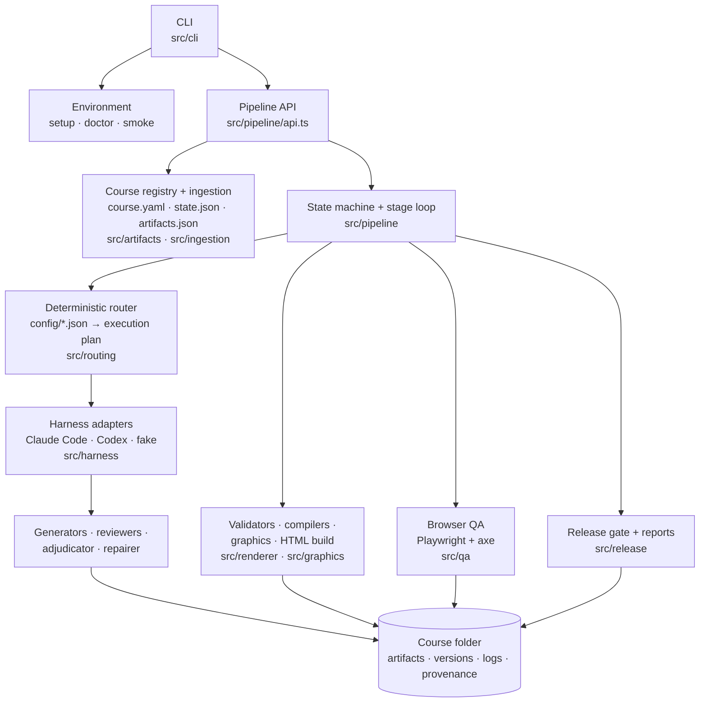
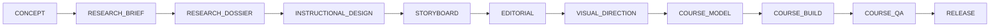

# CourseForge

CourseForge is a local, repository-contained course-engineering harness. It takes a one-line concept, or an
existing artifact from any production stage (research dossier, instructional design, storyboard, finished HTML
course), and drives it through a deterministic eleven-stage pipeline to a tested, accessible, single-file HTML
course. Claude Code or Codex does the semantic work (research, authoring, review, repair); TypeScript code
decides everything else: which stage runs, which reviewers and tools are used, which renderer draws each figure,
when a human must approve, and whether the course may be released.

It is not a prompt collection. Prompts are data files routed by code. Every agent call runs against a saved
execution plan, returns schema-validated JSON, and is audited: writes outside the plan are rolled back, locked
content cannot be changed, repair cycles are capped, and every decision is logged so a run can be explained
and resumed.

- [Architecture](#architecture) · [Pipeline](#pipeline) · [Features](#key-features) · [Install](#install) ·
  [Quick start](#quick-start) · [Example: importing existing work](#example-importing-existing-work) ·
  [Human review](#human-review-workflow) · [Outputs](#outputs) · [Troubleshooting](#troubleshooting) ·
  [Limitations](#limitations) · [Development](#development)

## Architecture



Only `src/harness/` knows that Claude Code or Codex exist, and only `src/core/proc.ts` spawns processes. Both
rules are enforced by a boundary test. See [docs/architecture/overview.md](docs/architecture/overview.md).

## Pipeline



| Stage | Work | Review / gate |
|---|---|---|
| CONCEPT | Agent normalises the concept, classifies risk tier | 1 reviewer |
| RESEARCH_BRIEF | Agent writes the brief | 3 reviewers, section validator |
| RESEARCH_DOSSIER | Agent researches per section (web tools); code mints claim IDs | 5 reviewers, citation/ID integrity |
| INSTRUCTIONAL_DESIGN | Agent writes design JSON; code renders Markdown | 5 reviewers, alignment validators |
| STORYBOARD | Agent writes one module per task; code merges | 6 reviewers, 9 validators, **hybrid gate by default** |
| EDITORIAL | Agent edits prose only | 2 reviewers, structural diff + polarity guard |
| VISUAL_DIRECTION | Agent picks bounded design enums; code expands tokens, checks contrast, routes visuals | 5 reviewers |
| COURSE_MODEL | Deterministic compile of `course.json` + trace graph | validators only |
| COURSE_BUILD | Deterministic graphics + single-file HTML | build checks (single file, IDs, size, text equivalents) |
| COURSE_QA | Playwright functional QA, axe, screenshots, then a 10-reviewer panel | repair loop, regression report |
| RELEASE | Pure release gate, reports, manifest, licences | gate reasons; human gate on elevated/high-stakes courses |

Every agent stage runs the same loop: plan → generate → validators + reviewer panel → deterministic
pre-adjudication → optional AI adjudication → repair plan → scoped repair → targeted re-review (at most 3 cycles
by default) → human gate → lock. Details: [state machine](docs/architecture/state-machine.md),
[review and repair](docs/architecture/review-and-repair.md).

## Key features

- **Deterministic routing and saved execution plans.** `config/*.json` registries decide stages, reviewers,
  skills, tools, renderers and fallbacks. The plan is written to `logs/execution-plans/` and every decision to
  `logs/routing-decisions.jsonl` before any agent runs. Identical inputs produce identical plans.
- **Reviewer ensembles, adjudication and bounded repair.** Findings are deduplicated and merged by code; an AI
  adjudicator runs only for contradictions, blockers or low-confidence findings. Repairs replace whole objects by
  stable ID, are checked against the plan, locks and schemas, and are rolled back on violation.
- **Human gates: auto, hybrid, human.** Per stage, per course, or per run, with risk-tier floors that
  high-stakes courses cannot silently lower.
- **Any-stage ingestion.** Import Markdown, text, HTML, JSON, DOCX or PDF at any stage in `preserve`,
  `review-only`, `improve` or `rebuild` mode. Originals are kept byte-for-byte and re-verified at release.
- **Traceability.** source → claim → learning objective → block → item → component → HTML element, queryable
  with `courseforge trace` and rendered into the DOM as `data-cf-*` attributes.
- **Single-file accessible HTML.** No external requests, hashed Content-Security-Policy, keyboard-first
  interactions, light/dark themes, reduced motion, progress persistence.
- **Structured graphics.** 22 visual archetypes routed to Mermaid, native SVG builders, SVG.js, Vega-Lite or D3,
  with a bounded fallback chain that always ends in a text equivalent.
- **Real browser QA.** Playwright drives every screen and interaction; axe-core serious/critical violations
  block release.
- **Existing-HTML improvement.** Arbitrary HTML courses are crawled, reviewed and rebuilt through CourseForge
  components, with a before/after regression report.
- **Claude Code and Codex.** Same pipeline, same schemas, same fixtures; the backend is a per-run choice.

## Requirements

- Node.js **22.12 or newer** (24 LTS recommended) with npm
- Git (to clone; optional afterwards)
- Optional, for live generation: [Claude Code](https://docs.anthropic.com/en/docs/claude-code) (`claude`) or
  [Codex CLI](https://github.com/openai/codex) (`codex`), installed and signed in
- About 1 GB of disk for dependencies plus Playwright Chromium; 2 GB of free RAM or more is recommended

No global npm packages are installed and no user-level configuration is modified.

## Install

```powershell
# Windows (PowerShell 5.1 or 7)
git clone <repo-url> CourseForge
cd CourseForge
.\setup.ps1
```

```sh
# macOS / Linux (or Git Bash on Windows)
git clone <repo-url> CourseForge
cd CourseForge
./setup.sh
```

`setup.ps1` / `setup.sh` check the Node.js version (printing the exact install command if it is missing or too
old), then run `scripts/bootstrap.mjs`, which:

1. records the environment (platform, RAM, cloud-synced folder advisory);
2. runs `npm ci` (skipped when the lockfile is unchanged; retried on Windows file locks);
3. installs Playwright Chromium into the shared per-user browser cache (never inside the repository);
4. compiles TypeScript to `dist/`;
5. runs `doctor --repair` for repository-local problems;
6. runs the smoke fixture: build a small course, render diagrams, launch Chromium, drive an interaction, run axe,
   take a screenshot.

It prints `READY` only when doctor and the smoke fixture pass. Re-running is idempotent. Flags: `--no-smoke`,
`--offline`, `--ci`, `--json`. See [docs/user-guide/installation.md](docs/user-guide/installation.md).

Run the CLI without a global install: `.\courseforge <command>` (Windows), `./courseforge <command>`,
`npm run courseforge -- <command>`, or `node bin/courseforge.mjs <command>`.

## Quick start

### Offline demo (no agent, no network)

The fake harness replays a committed, schema-valid fixture set for a micro-course, so the whole pipeline runs
without a model:

```powershell
$env:COURSEFORGE_HARNESS='fake'; $env:COURSEFORGE_FIXTURES='tests/fixtures/harness/demo'
.\courseforge new "Spotting Phishing Emails" --to release
```

```sh
export COURSEFORGE_HARNESS=fake COURSEFORGE_FIXTURES=tests/fixtures/harness/demo
./courseforge new "Spotting Phishing Emails" --to release
```

The run pauses at STORYBOARD (exit code 10) because that stage has a `hybrid` gate by default. Review the files
under `courses/spotting-phishing-emails/storyboard/`, then:

```sh
./courseforge gate approve --course spotting-phishing-emails --stage storyboard
./courseforge continue --course spotting-phishing-emails
```

Pass `--gate auto` to `new` to run without pausing (standard-risk courses only). If QA finds blocking issues,
the run pauses at COURSE_QA with a consolidated review in `review/consolidated-review.md`.

### Real run

```sh
./courseforge doctor                       # confirm claude and/or codex are installed and signed in
./courseforge new "Safe Ladder Use" --audience "warehouse staff" --duration 30 --to storyboard
./courseforge status --course safe-ladder-use
./courseforge run --course safe-ladder-use --to release --backend codex
```

Backend selection: `--backend` flag, else `pipeline.agent_backend` in `course.yaml`, else `auto` (first
available and signed-in backend in `config/fallbacks.json` order). Live runs cost model tokens and take time;
see [Limitations](#limitations).

## Example: importing existing work

Start from any stage. The example lineage in [`examples/chemical-risk/`](examples/README.md) is the author's own
portfolio work, used as a regression fixture:

```sh
# a storyboard: review, adjudicate and repair it, then continue to release
./courseforge ingest examples/chemical-risk/04_storyboard.md --course chem-demo --stage storyboard --mode improve
./courseforge run --course chem-demo --to release

# a finished HTML course: reconstruct the model, crawl, review, rebuild through CourseForge components
./courseforge ingest examples/chemical-risk/06_interactive_course.html --course chem-html --stage course_build --mode improve
./courseforge run --course chem-html --to release --gate auto
```

The stage is inferred when `--stage` is omitted: deterministic heuristics first, then (only if they are not
decisive) a closed-enum agent classifier; if confidence is still low the import stops with a clear message
unless `--conservative` (review-only) is given. Every import writes `input/intake-report.json` (inferred stage and
evidence, contract gaps, IDs found, warnings, next legal targets). See
[docs/user-guide/ingestion.md](docs/user-guide/ingestion.md).

| Mode | Generate | Review | Repair |
|---|---|---|---|
| `preserve` | no | no (validators only) | no |
| `review-only` | no | yes | no |
| `improve` | no | yes | yes |
| `rebuild` | yes (import is source material) | yes | yes |

## Human review workflow

```sh
./courseforge status --course <id>                          # stage table, gates, open findings, next action
./courseforge findings list --course <id> --stage storyboard
./courseforge findings accept --course <id> --ids SB-C0-003,SB-C0-007
./courseforge findings reject --course <id> --ids SB-C0-004
./courseforge gate lock --course <id> --stage storyboard --ids M2-B03   # protect a block from any repair
./courseforge gate reject --course <id> --stage storyboard --instructions "Shorten module 2 scenarios"
./courseforge gate approve --course <id> --stage storyboard
./courseforge continue --course <id>
```

Gate modes: `auto` locks when no blocking findings remain; `hybrid` runs the AI repair loop, then waits for
approval; `human` waits for approval without AI repair. A paused run exits with code 10. See
[docs/user-guide/human-review.md](docs/user-guide/human-review.md).

## Outputs

```text
courses/<course-id>/
├─ course.yaml              # course manifest (risk tier, backend, human_review gates)
├─ state.json               # per-stage status, gates, cycles, canonical artifact pointers
├─ artifacts.json           # registry: every artifact version with hash, producer, parents, locks
├─ input/                   # concept, originals/ (read-only), intake-report.json
├─ research/                # research-brief, research-dossier (.json + .md), sources.jsonl, claims.jsonl
├─ design/                  # instructional-design (.json + .md)
├─ storyboard/              # storyboard, storyboard-edited, editorial-diff.json
├─ visual/                  # direction, design tokens, component plan, visual specs
├─ model/                   # course.json, trace.json, build-manifest.json
├─ build/                   # index.html, build-report.json
├─ review/                  # functional-tests, accessibility-review, screenshots/, findings/, repair plan, regression
├─ release/                 # course.html, qa-report.md, source-report.md, release-manifest.json, licenses/
├─ versions/                # immutable snapshots (<artifact>-v<N>-<event>/)
└─ logs/                    # execution-plans/, routing-decisions.jsonl, run-events.jsonl, tasks/
```

Each stage keeps its reviewer outputs, findings and repair plans under `<stage-dir>/review/<stage>/c<cycle>/`.

## QA and release gates

COURSE_QA runs a contract-driven Playwright pass over CourseForge builds (every screen, every interaction with
the model's answer key and a mutated wrong answer, scoring, navigation, glossary, references, progress and
reset, offline behaviour, console errors, overflow, keyboard focus, axe per screen, screenshots at 1440/768/390)
or a heuristic crawler for arbitrary imported HTML. The release gate is a pure function that blocks on:

`OPEN_BLOCKING_FINDING` · `AXE_BLOCKING_VIOLATION` · `FUNCTIONAL_FAILURE` · `MISSING_ARTIFACT` ·
`CITATION_INTEGRITY` · `LOCK_CONFLICT` · `CYCLES_EXHAUSTED` · `ORIGINAL_MODIFIED` · `BUILD_CHECK_FAILED` ·
`HUMAN_APPROVAL_REQUIRED`

See [docs/architecture/qa.md](docs/architecture/qa.md).

## Claude Code and Codex

| | Claude Code | Codex CLI |
|---|---|---|
| Invocation | `claude -p --output-format stream-json`, prompt on stdin | `codex exec --json … -`, prompt on stdin |
| Structured output | `--json-schema` (inline) | `--output-schema <file>` + `-o <file>` |
| Isolation from user config | `--safe-mode`, `--setting-sources project`, `--strict-mcp-config` | `--ignore-user-config`, `--ignore-rules`, `--ephemeral` |
| Permissions | `--permission-mode dontAsk`, tool allowlist, `Edit(...)` allow rules for writable paths | `-s read-only` or `workspace-write`, approvals `never` |
| Known gap | none known | the global `~/.codex/AGENTS.md` cannot be disabled; a role preamble tells the agent to ignore it |

Flags are probed from `--help` and used only when present. In both cases the hard guarantee is CourseForge's own
write audit. See [docs/architecture/harness.md](docs/architecture/harness.md).

## Troubleshooting

| Symptom | Fix |
|---|---|
| Anything looks wrong | `./courseforge doctor` (add `--repair` to fix repository-local issues, `--json` for machine output) |
| `EPERM` / `EBUSY` during install or runs | The repo is in a OneDrive/Dropbox/iCloud folder with sync active. Pause sync or clone elsewhere |
| `pw.chromium` fails | `npx playwright install chromium` (Linux: `npx playwright install --with-deps chromium`) |
| "running scripts is disabled" on Windows | `Set-ExecutionPolicy -Scope Process Bypass`, then `.\setup.ps1`; ZIP downloads: `Get-ChildItem -Recurse *.ps1 \| Unblock-File` |
| Slow QA or browser crashes | Close other browsers; doctor warns below 2 GB free RAM |
| `No agent backend available` | Install and sign in: run `claude` once, or `codex login`; or use the fake harness |
| Codex output influenced by personal instructions | Your `~/.codex/AGENTS.md` is always loaded by Codex; isolation is partial (see above) |

More in [docs/user-guide/troubleshooting.md](docs/user-guide/troubleshooting.md).

## Limitations

- Automated accessibility checks (axe, keyboard and focus checks) are not a formal WCAG conformance audit.
- Live generation of a full course takes a long time and costs model tokens; tests and the demo use fixtures.
- PPTX import is not supported (DOCX and PDF are, via text extraction).
- SCORM / xAPI packaging is not in v1; the output is a standalone HTML file.
- AI-generated imagery is not included; figures are structured diagrams, charts and icons.
- Codex isolation is partial: the user-global `AGENTS.md` cannot be switched off.
- No pixel-baseline visual regression in v1; screenshots are evidence for reviewers, not golden images.
- Of the four AI classifiers (import stage, visual archetype, claim category, risk tier), only the import-stage
  classifier is wired in (as a fallback when heuristics are not decisive). Visual archetypes and risk tier are set
  by the storyboard/visual-direction and concept agents; claim categories by the research agent.
- Backend fallback happens at most once per run and only for configured failure classes (off by default).
- Crash recovery restarts an interrupted stage, reusing its generated outputs; review cycles are rerun.

## Development

| Script | Purpose |
|---|---|
| `npm run build` | Compile TypeScript to `dist/` |
| `npm run typecheck` | `tsc --noEmit` |
| `npm run lint` / `npm run format` | Biome check / format |
| `npm test` | Unit + integration tests (Vitest, fake harness, no network) |
| `npm run test:e2e` | Playwright end-to-end tests |
| `npm run test:acceptance` | Acceptance matrix: spec-10 requirement IDs (A1–L7) → tests |
| `npm run gen:schemas` | Regenerate `schemas/*.schema.json` from the zod sources |
| `npm run doctor` / `npm run smoke` | Environment check / smoke fixture |
| `npm run smoke:clean` | Fresh-clone setup test in a temp directory |
| `npm run coverage` | Coverage report |
| `npm run ci` | typecheck + lint + test + e2e |

Read [CONTRIBUTING.md](CONTRIBUTING.md) and the [developer guide](docs/developer-guide/contributing-workflow.md).
Design decisions are recorded as [ADRs](docs/adr/README.md). Security: [SECURITY.md](SECURITY.md).

## License

MIT, see [LICENSE](LICENSE). Third-party components and notices: [THIRD-PARTY.md](THIRD-PARTY.md).
