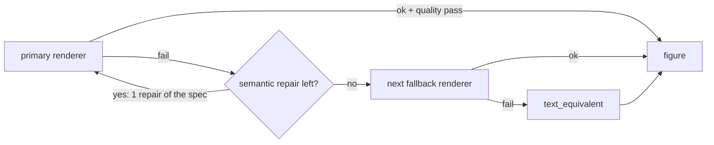

# Instructional graphics

Figures are data, not pictures an agent draws. The storyboard and VISUAL_DIRECTION stages produce `VisualSpec`
records; code routes each one to a renderer, renders it deterministically at COURSE_BUILD, post-processes the
SVG into a safe, accessible, themeable inline figure, and falls back in a bounded way when anything fails.

## Visual specs

`VisualSpecSchema` (`src/core/schemas/content.ts`):

| Field | Notes |
|---|---|
| `id`, `title`, `purpose` | `purpose` is the instructional job the figure does |
| `archetype` | One of 22 (below) |
| `content` | `items[] {id, label, detail, group, value}`, `links[] {from, to, label}`, `groups[]`, `columns[]`, `rows[]`, `axes`, `chartType` (`bar`, `stacked-bar`, `line`, `area`, `point`) |
| `sourceIds` | Evidence behind the figure (traceability) |
| `textEquivalent` | `short` (becomes `<title>`) and `long` (becomes `<desc>` and a linked long description). Required; the `visual-text-equivalents` validator rejects authoring-instruction text such as "Alt text: …" |
| `interaction` | `none`, `reveal`, `interactive-data` |
| `rendererOverride` | Optional; honoured only if it names a registered renderer |
| `mermaid` | Optional explicit Mermaid source; otherwise generated from `content` |

Agents choose archetypes from the closed enum; they never choose renderers.

## Archetypes

`PROCESS, LIFECYCLE, TIMELINE, HIERARCHY, DECISION_TREE, COMPARISON, BEFORE_AFTER, LAYERED_SYSTEM,
RESPONSIBILITY_MAP, FEEDBACK_LOOP, CAUSE_EFFECT, CONTINUUM, MATRIX, LABELED_OBJECT, EVIDENCE_MAP, FUNNEL,
RELATIONSHIP_NETWORK, QUANTITATIVE_CHART, SCENARIO_MAP, SYSTEM_ARCHITECTURE` (the 20 of the visual spec) plus the
Mermaid-native `SEQUENCE` and `STATE_DIAGRAM`. The archetype → renderer table is in
[routing.md](routing.md#visual-routing).

## Renderers

| Renderer | Where it runs | Implementation |
|---|---|---|
| `mermaid` | In the shared Playwright Chromium page | `src/graphics/mermaid.ts`: source generated from `content` with grammar-safe labels; `securityLevel: 'strict'`, `htmlLabels: false` (no `foreignObject`), `deterministicIds` with a per-visual seed, theme variables derived from design tokens. No `@mermaid-js/mermaid-cli` (see [ADR 0003](../adr/0003-mermaid-in-playwright-not-mermaid-cli.md)) |
| `cf_svg` | Node, no browser | `src/graphics/native/`: pure TypeScript builders for PROCESS, LIFECYCLE, FEEDBACK_LOOP, TIMELINE, CONTINUUM, FUNNEL, COMPARISON, BEFORE_AFTER, MATRIX, LAYERED_SYSTEM, RESPONSIBILITY_MAP, HIERARCHY, SCENARIO_MAP, EVIDENCE_MAP. Other archetypes throw, which moves the chain to the next renderer |
| `svgjs` | In the shared page | `src/graphics/svgjs.ts`: SVG.js with real font metrics; generic card grid for any spec, plus LABELED_OBJECT callouts and a radial RELATIONSHIP_NETWORK layout |
| `vega_lite` | Node, headless | `src/graphics/vega.ts`: Vega-Lite → Vega → `new View(…, { renderer: 'none' }).toSVG()`; no canvas, no browser |
| `d3` | In the shared page | `src/graphics/d3.ts`: bar/line charts and a force-directed network with deterministic initial positions and a fixed tick count |
| `lucide` | Node | `src/graphics/lucide.ts`: a single icon from `lucide-static`, as `currentColor` strokes |
| `text_equivalent` | Node | Structured text block built from the spec; always succeeds |

One Chromium page (`src/graphics/browser.ts`) is reused for every in-page renderer and for text measurement, so
a build launches a single browser. No renderer runtime (Mermaid, Vega, D3, SVG.js) is shipped in the course; only
the resulting SVG is.

## Bounded render loop

`renderVisual` (`src/graphics/render.ts`):

`fallbacks.json#renderer.maxSemanticRepairs` is 1: after a failure the pipeline may ask an agent for one repaired
spec (`prompts/templates/visual-repair.md`), re-rendered with the same renderer. Every attempt (renderer, ok,
error) is recorded in `build/build-report.json` with `fallbackUsed`. A figure never ships broken: the worst case
is a clearly structured text equivalent.

## Post-processing (`src/graphics/postprocess.ts`)

Applied to every renderer's output, deterministically:

- strip XML prologue, comments, `<script>`, `<iframe>`, `<object>`, `<embed>`, media, `<canvas>`; reject
  `<foreignObject>`; remove `on*` handlers, `javascript:` values, external `href`s and external `url()` refs;
- prefix every `id` with `cf-<visualId>-` and rewrite all references (`url(#…)`, `href="#…"`, ARIA ID lists);
- add `role="img"`, `<title>` (short text equivalent), `<desc>` (long text equivalent) and ARIA links;
- size by `viewBox` only (no fixed width/height);
- map literal colours to the nearest palette slot as `var(--cf-viz-N, #hex)` so figures follow light/dark themes.

## Quality checks (`src/graphics/quality.ts`)

Static: well-formed XML, `<svg>` root with a viewBox and no fixed width/height, `role="img"` with `<title>` and
`<desc>` wired through `aria-labelledby`, no scripts, `foreignObject`, event handlers or external references,
unique and correctly prefixed IDs. In the browser, at several widths: text extending outside the viewBox, text
rendered below the minimum font size, overlapping sibling labels. A failed check counts as a render failure and
enters the loop above. Token-level colour contrast is checked separately at VISUAL_DIRECTION
(`direction-contrast`).

## Icons

Icons are a closed vocabulary (`ICONS` in `components/course-ui/src/contract.ts`; semantic names mapped in
`routing.json#icons`). The compiler inlines only referenced icons into a hidden sprite and adds the Lucide ISC
notice as an HTML comment; RELEASE copies the licence to `release/licenses/lucide-ISC.txt`.

## Not in v1

AI-generated or photographic imagery (no image provider is wired), pixel-baseline comparison of figures
(see [ADR 0008](../adr/0008-no-pixel-baselines-v1.md)).

## Tests

`tests/unit/graphics/*` (native builders, Mermaid source, post-processing), `tests/integration/graphics/renderers.test.ts`
(H1–H3), `tests/integration/graphics/fallback.test.ts` (H4), `tests/unit/routing/visual-router.test.ts` (D2).
