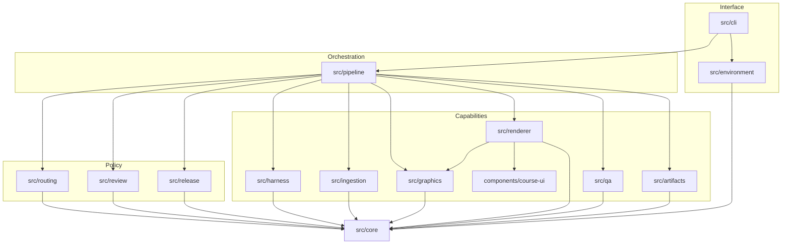
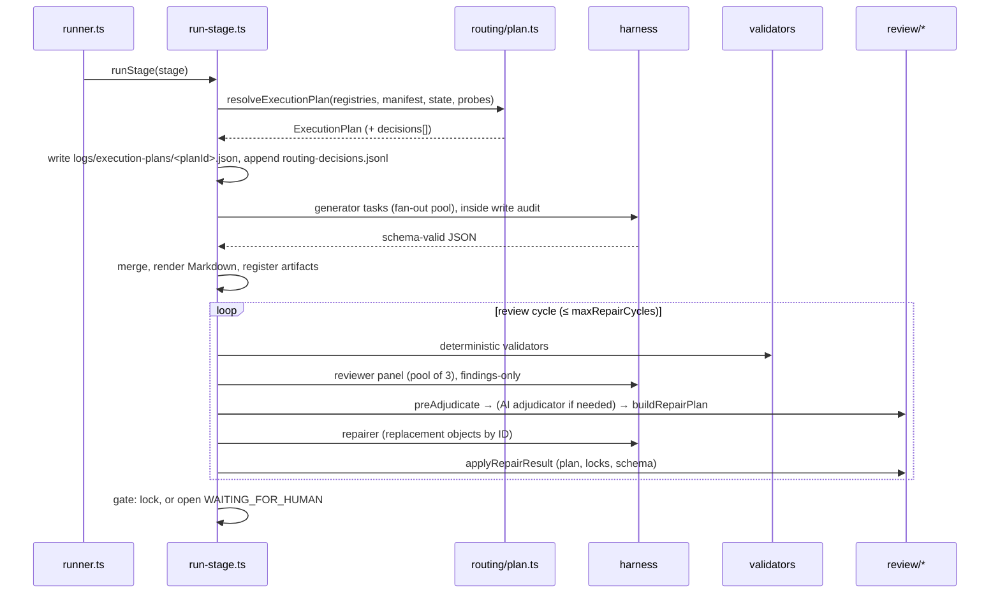

# Architecture overview

CourseForge is a TypeScript/Node program with a thin CLI over a pipeline API. Agents (Claude Code or Codex) are
subprocesses that return schema-validated JSON; everything that decides *what* runs is deterministic code driven
by JSON registries.

## Layers

Dependencies point downward. `src/core` imports nothing from the rest of the codebase. `src/routing`,
`src/review` and `src/release` are pure (no filesystem, no clock, no randomness) and are the most heavily
tested modules. `src/pipeline` is the only module that combines everything, and `src/cli` depends only on the
pipeline API and the environment module.

## Module map

| Module | Responsibility | Key files |
|---|---|---|
| `src/core` | Closed enums, zod schemas, IDs, hashing (LF-normalised), atomic writes and course lock, the single process-spawn point, JSONL logs, paths | `enums.ts`, `schemas/*`, `fsx.ts`, `proc.ts`, `hash.ts`, `paths.ts`, `wire-schema.ts` |
| `src/routing` | Registry loading and cross-checks; `resolveExecutionPlan`; backend selection; gate strictness; visual routing | `plan.ts`, `registries.ts`, `backend.ts`, `gates.ts`, `visual.ts` |
| `src/artifacts` | `artifacts.json` registry, version snapshots, drift detection, section locks, trace graph | `registry.ts`, `locks.ts`, `trace.ts` |
| `src/harness` | `AgentHarness` contract; Claude, Codex and fake adapters; prompt assembly; recording | `types.ts`, `claude.ts`, `codex.ts`, `fake.ts`, `prompt.ts`, `record.ts` |
| `src/review` | Finding normalisation, pre-adjudication, repair-plan builder, scoped repair application, consolidated report, reviewer pool | `findings.ts`, `adjudicate.ts`, `repair-plan.ts`, `apply.ts`, `report.ts`, `pool.ts` |
| `src/ingestion` | File adapters (md, txt, html, json, docx, pdf), stage inference, normalisers per stage, intake report | `intake.ts`, `infer.ts`, `adapters/*`, `normalize/*` |
| `src/graphics` | Renderers (Mermaid, native SVG, SVG.js, Vega-Lite, D3, Lucide), shared SVG post-processing, quality checks, bounded render loop | `render.ts`, `native/*`, `postprocess.ts`, `quality.ts` |
| `src/renderer` | Single-file HTML compiler and build checks | `compile.ts`, `checks.ts`, `icons.ts` |
| `components/course-ui` | Build-time render functions, design tokens, learner runtime (`window.__cf`) | `src/components/*`, `src/runtime/*`, `tokens/*` |
| `src/qa` | Contract-driven QA, heuristic crawler, axe, detectors, regression comparison | `run.ts`, `contract.ts`, `crawler.ts`, `axe.ts`, `regression.ts` |
| `src/release` | Pure release gate; QA report, source report, release manifest | `gate.ts`, `reports.ts` |
| `src/pipeline` | Run context, state transitions, generic stage loop, stage handlers, write audit, public API | `api.ts`, `impl.ts`, `runner.ts`, `run-stage.ts`, `agent.ts`, `stages/*` |
| `src/environment` | Doctor check catalogue, repair actions, formatting | `checks.ts`, `doctor.ts` |
| `src/tracker` | Optional self-hosted results server and dashboard (`courseforge tracker`) | `server.ts`, `store.ts`, `dashboard.ts` |
| `src/cli` | Argument parsing (`node:util` `parseArgs`), dispatch, exit codes, output formatting | `main.ts`, `help.ts`, `args.ts`, `output.ts` |

## Provider-neutral core

Only `src/harness/**` mentions the `claude` or `codex` binaries, their flags or their output formats. Everything
else talks to the `AgentHarness` interface (`probe()` + `run()`), and the backend name appears only as the
`BackendName` enum. The boundary test (`tests/unit/arch/boundary.test.ts`) enforces this and the next rule.

## One subprocess entry point

`src/core/proc.ts` is the only file that may import `child_process`. It uses `cross-spawn` with `shell: false`,
passes prompts on stdin (never argv, which avoids the Windows 8191-character limit and quoting bugs), enforces
timeouts and returns captured output. Harness adapters take an injectable `runner(argv, stdin)` so tests replay
recorded CLI output without spawning anything. The boundary covers `src/` and `components/`; the standalone
tooling scripts in `scripts/*.mjs` (bootstrap, acceptance matrix, fresh-clone smoke) use `node:child_process`
directly because they run before or outside the compiled application.

## Data flow of one stage

## Course isolation

All course state lives under `courses/<id>/` (overridable with `COURSEFORGE_COURSES_DIR`). A course holds its
manifest, state, artifact registry, originals, versions, reviews and logs, so it can be zipped
(`courseforge package`) and moved. A run holds `courses/<id>/.lock` (created exclusively; a stale lock from a
dead process is stolen and logged; otherwise the command exits 5). Writes use temp-file + rename with retries for
Windows/antivirus/sync locks. Repository-level machine state lives in `.courseforge/` (gitignored).

## Related documents

- [State machine](state-machine.md) · [Routing](routing.md) · [Review and repair](review-and-repair.md)
- [Harness](harness.md) · [Traceability](traceability.md) · [Graphics](graphics.md)
- [Course runtime](course-runtime.md) · [QA](qa.md) · [Setup and tracking](tracking.md) · [ADRs](../adr/README.md)
