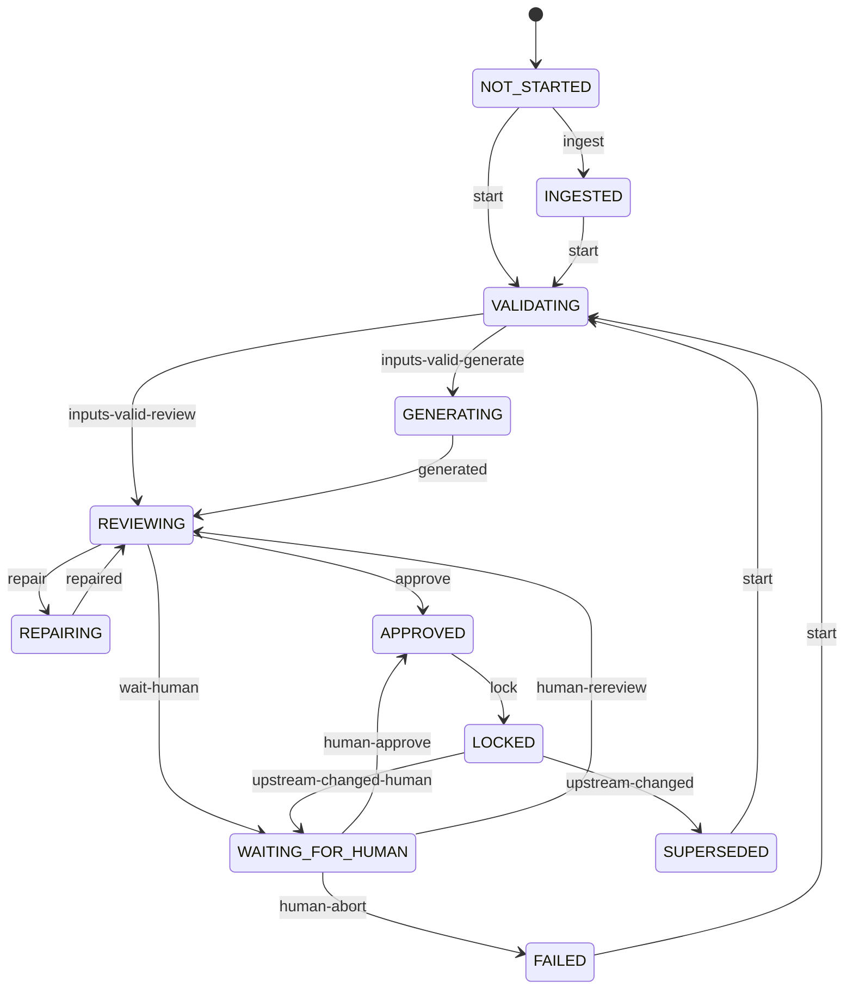

# State machine

Each course has one `state.json` with a status per stage. Transitions are driven by named triggers and checked
against a single table in `src/pipeline/transitions.ts`; an illegal transition throws `IllegalTransitionError`.

## Stages

`CONCEPT → RESEARCH_BRIEF → RESEARCH_DOSSIER → INSTRUCTIONAL_DESIGN → STORYBOARD → EDITORIAL → VISUAL_DIRECTION →
COURSE_MODEL → COURSE_BUILD → COURSE_QA → RELEASE` (`STAGES` in `src/core/enums.ts`). The CLI also accepts the
aliases `concept, brief, research|dossier, design, storyboard, editorial, visual, model, build, qa, release` and
any casing of the canonical names.

## Statuses

| Status | Meaning |
|---|---|
| `NOT_STARTED` | No work and no imported artifact |
| `INGESTED` | An artifact was imported (or a human edit / restored version was detected); the next run treats it per its intake mode |
| `VALIDATING` | Plan resolved, inputs being checked |
| `GENERATING` | Generator agents or a deterministic compiler are producing outputs |
| `REVIEWING` | Validators and the reviewer panel are running |
| `REPAIRING` | The repairer is applying an approved repair plan |
| `WAITING_FOR_HUMAN` | A gate is open (policy, high stakes, cycle cap, lock conflict, blocking findings, upstream change) |
| `APPROVED` | Accepted, about to be locked |
| `LOCKED` | Canonical outputs fixed; downstream stages may consume them |
| `FAILED` | Stopped with a classified failure (`state.stages[S].failure`) |
| `SUPERSEDED` | Was locked, but an upstream stage produced new canonical content |

## Transition table

Generated from `TABLE` in `src/pipeline/transitions.ts` (also available at runtime via `transitionTable()`).

| From | Trigger | To |
|---|---|---|
| NOT_STARTED | `ingest` | INGESTED |
| NOT_STARTED | `start` | VALIDATING |
| INGESTED | `start` | VALIDATING |
| INGESTED | `ingest` | INGESTED |
| VALIDATING | `inputs-valid-generate` | GENERATING |
| VALIDATING | `inputs-valid-review` | REVIEWING |
| VALIDATING | `wait-human` | WAITING_FOR_HUMAN |
| VALIDATING | `fail` | FAILED |
| GENERATING | `generated` | REVIEWING |
| GENERATING | `fail` | FAILED |
| GENERATING | `wait-human` | WAITING_FOR_HUMAN |
| REVIEWING | `repair` | REPAIRING |
| REVIEWING | `approve` | APPROVED |
| REVIEWING | `wait-human` | WAITING_FOR_HUMAN |
| REVIEWING | `fail` | FAILED |
| REPAIRING | `repaired` | REVIEWING |
| REPAIRING | `fail` | FAILED |
| REPAIRING | `wait-human` | WAITING_FOR_HUMAN |
| WAITING_FOR_HUMAN | `human-approve` | APPROVED |
| WAITING_FOR_HUMAN | `human-rereview` | REVIEWING |
| WAITING_FOR_HUMAN | `human-repair` | REPAIRING |
| WAITING_FOR_HUMAN | `human-abort` | FAILED |
| WAITING_FOR_HUMAN | `ingest` | INGESTED |
| WAITING_FOR_HUMAN | `start` | VALIDATING |
| APPROVED | `lock` | LOCKED |
| LOCKED | `upstream-changed` | SUPERSEDED |
| LOCKED | `upstream-changed-human` | WAITING_FOR_HUMAN |
| LOCKED | `ingest` | INGESTED |
| LOCKED | `start` | VALIDATING |
| FAILED | `start` | VALIDATING |
| FAILED | `ingest` | INGESTED |
| FAILED | `reset` | NOT_STARTED |
| SUPERSEDED | `start` | VALIDATING |
| SUPERSEDED | `ingest` | INGESTED |
| SUPERSEDED | `reset` | NOT_STARTED |

`VALIDATING`, `GENERATING`, `REVIEWING` and `REPAIRING` are the in-flight statuses (`IN_FLIGHT`).

## Stage-range legality

`run --from A --to B` requires `index(A) ≤ index(B)` (`stageRange`, otherwise exit 2). When `--from` is omitted
the runner starts at the first touched stage that is not `LOCKED`, or after the last locked stage, or at
`pipeline.start_stage`. Stages before an imported stage stay `NOT_STARTED`. A generating stage whose required
inputs are missing fails with `input_invalid`. The run loop stops at the first stage that does not end `LOCKED`
and reports `completed`, `waiting`, `failed` or `blocked` (exit 0, 10, 11, 4). A `LOCKED` stage is skipped unless
`--force` is given for the start stage.

## Resume and crash recovery

- Every step appends `step` events (`plan`, `generate`, `review#N`, `repair#N`, `rebuild#N`) to
  `logs/run-events.jsonl`; agent calls add `task.start` / `task.end` with backend, version, usage and failure class.
- `continue` re-runs the pipeline from the default start stage to the saved `targetStage`.
- A stage found in an in-flight status (the previous process died) is logged as `stage.recovered`, moved to
  `FAILED`, and restarted. If generation had completed and all declared outputs exist, the outputs are reused and
  the stage goes straight to review.
- A stage in `WAITING_FOR_HUMAN` resumes according to its gate: pending → still waiting; approved → locked
  (a `human-approved` version is registered); rejected → re-review with the human's instructions injected as an
  accepted `major` finding and one extra repair cycle allowed.

## Invalidation of downstream stages

When a stage produces new canonical content (generation, repair, rebuild), every later stage that is `LOCKED`
is invalidated:

- if its gate was approved by a named human, it moves to `WAITING_FOR_HUMAN` with reason `upstream_changed`
  (human-approved work is never replaced silently);
- otherwise it becomes `SUPERSEDED` with `stale = { because, at }` and will be regenerated.

`ingest` into a stage does the same for later locked stages. Direct edits to canonical files are detected as
drift at the start of every run (hash mismatch against `artifacts.json`): the edit is registered as a
`human-edited` version, the stage returns to `INGESTED` in `preserve` mode, and the run starts from the earliest
drifted stage.

## Course lock

A run takes `courses/<id>/.lock` exclusively (`{pid, host, startedAt, cmd}`). A lock left by a dead process on
the same host is removed and logged as `lock.stolen`; any other holder makes the command exit 5.

## Tests

`tests/unit/pipeline/pipeline-units.test.ts` (transition table, stage range) and
`tests/integration/pipeline/pipeline.test.ts` (stage ranges, continue after interruption, gates, locks, cycle
caps, versions) cover this document.
