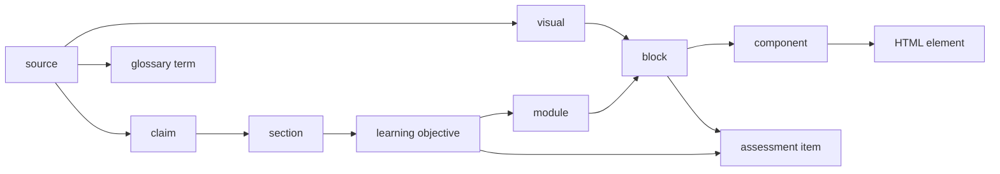

# Traceability

Every learner-facing element can be traced back to the evidence behind it, and every source forward to where it
is used:



## IDs

- Grammar: `^[A-Za-z][A-Za-z0-9]*([-_.][A-Za-z0-9]+)*$`, at most 60 characters (`src/core/ids.ts`).
- **The kind of an ID comes from the artifact it lives in, never from its text.** Graph keys are
  `<kind>:<id>`. This is why imported mnemonic IDs survive verbatim (`AB-OHS-4`, `LO4`, `T3-07`, `F1-01`,
  `GA-15`, `V-07`).
- Citation tokens may carry a locator: `AB-OHS-4 s.21` resolves to source `AB-OHS-4` with locator `s.21`.
- IDs CourseForge mints: sources `SRC-001`, claims `CLM-0001` (stable once minted in RESEARCH_DOSSIER),
  objectives `LO1`…, modules `M1`…, blocks `M1-B01`, formative items `M1-F01`, graded items `GA-01`, visuals
  `V-01`, glossary terms `GL-001`.

## Where edges live

Edges are stored only in their home artifacts; the graph is derived on demand by `buildTraceGraph(courseDir)`
(`src/artifacts/trace.ts`):

| Home artifact | Edges |
|---|---|
| `research/claims.jsonl` | claim → sources (`citations[].sourceId`), claim → dossier section |
| `research/research-dossier.json` | section → claims, sources |
| `design/instructional-design.json` | objective → claims, sources; module → objectives |
| `storyboard/storyboard[-edited].json` | block → objectives, claims, citations, visual; items are formative/graded blocks; glossary term → sources |
| `visual/visual-specs.json` | visual → sources |
| `model/course.json` | screens (components) → blocks |
| `build/index.html` | elements carry `data-cf-block`, `data-cf-lo`, `data-cf-claim`, `data-cf-source`, `data-cf-visual` |

A snapshot is written to `model/trace.json` at COURSE_MODEL and summarised in the release manifest.

## Queries

```sh
courseforge trace --course <id> --id LO4 --direction up        # LO4 → claims → sources
courseforge trace --course <id> --id AB-OHS-4 --direction down  # which blocks, items, screens use this source
courseforge trace --course <id> --id M2-B03 --depth 2
courseforge trace --course <id> --impact CLM-0007,SRC-004       # everything affected if these change
```

Output is JSON (nodes with kind, id, label, and the stages that own them).

## Trace validators

| Code | Severity | Meaning |
|---|---|---|
| `TRACE-DANGLING-REF` | critical | A reference points to an ID that does not exist (release-blocking) |
| `TRACE-DUP-ID` | major | The same `<kind>:<id>` is defined twice |
| `TRACE-ORPHAN-LO` | major | An objective is neither taught nor assessed |
| `TRACE-UNASSESSED-LO` | major | An objective has no formative or graded item |
| `TRACE-UNTAUGHT-ITEM` | major | An item is not mapped to any objective |
| `TRACE-UNCITED-CLAIM` | major | A claim cites no source |
| `TRACE-UNUSED-SOURCE` | minor | A source is never cited |

Dangling references are reported only for kinds whose home artifact was loaded, so a course imported at
STORYBOARD is not penalised for having no dossier.

## Evidence rules

- No fabricated citations: validators check every citation resolves (`citations-resolve`); the release gate
  blocks on dangling or unresolved inline citations (`CITATION_INTEGRITY`).
- Claims carry a `category` (law-regulation, scientific-technical, statistic, version-currentness,
  guidance-recommendation, definition, scenario-synthesis) so guidance is not restated as a legal requirement.
- Source currentness and licence notes propagate to `release/source-report.md`.

## Tests

`tests/unit/artifacts/trace.test.ts` (F5), `tests/integration/pipeline/pipeline.test.ts` (ID lineage),
`tests/integration/ingest/chemical-risk.test.ts` (imported IDs preserved).
